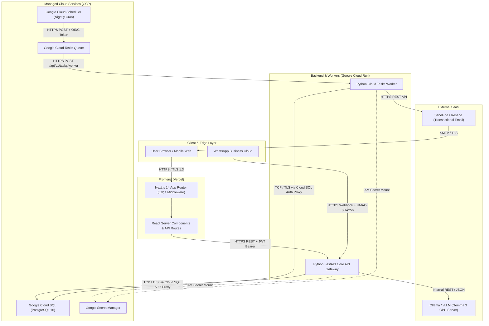

# PT Injani Systems — Fullstack Developer Prescreening Submission

**Candidate:** Adjie Hari Fajar  
**Position:** Programmer (NextJS & Python)  
**Date:** September 2026  
**Repository Source:** [https://github.com/adjiehf231/injani-fullstack-prescreening](https://github.com/adjiehf231/injani-fullstack-prescreening)

---

# Part A — Candidate Profile

## P1 — Work Style & Independence

### Question
> Describe how you typically work when given a task with minimal direction. Do you prefer to figure things out independently, or do you seek regular check-ins and guidance? Give a specific example from a past role.

### Answer
When given a task with minimal direction or ambiguous scope, I follow a timeboxed autonomous discovery process followed by an alignment checkpoint:

1. **Understand & Contextualize (First 1–2 hours):**  
   Rather than immediately asking for clarification or jumping into code, I inspect the existing system context—examining database schemas, API schemas, data models, and edge cases to clarify constraints and requirements.
2. **Formulate Technical Options & Trade-offs:**  
   I outline 1–2 practical implementation approaches, noting trade-offs (complexity, maintainability, performance) and my recommended path.
3. **Structured Alignment Check-in:**  
   I present a concise summary to the Lead Engineer or Product Owner:  
   *"Here is my understanding of the requirement, the proposed schema/API contract, and the trade-offs. If this aligns with expectations, I will proceed to implementation."*
4. **Execution with Incremental Visibility:**  
   Once aligned, I work independently with high velocity, breaking the task into small, testable commits and validating edge cases with automated tests. I only escalate blockers when an external dependency is unavailable or an unresolvable business ambiguity arises.

For example, in a previous role handling data validation and reporting workflows where specifications were incomplete, I analyzed the underlying database schemas and cross-referenced calculation outputs against historical records. I documented edge cases (such as null values and boundary conditions), proposed standardized validation rules, and reviewed the approach with the engineering lead in a brief 15-minute checkpoint. After securing alignment, I implemented the validation logic and automated test coverage, delivering a reliable solution without rework or ongoing supervision.

---

## P2 — Startup Environment Fit

### Question
> Have you worked in a startup or small team before? If yes, describe what that looked like — team size, your responsibilities, and how the pace/culture differed from larger organizations. If no, what makes you interested in joining one now?

### Answer
I am strongly drawn to small, high-growth engineering teams where developers take direct ownership of their work and collaborate closely across disciplines:

- **End-to-End Responsibility:** In a focused team, an engineer is not confined to a narrow silo. Having direct involvement across the full cycle—from requirements analysis and database queries to frontend interfaces and automated tests—creates deeper technical accountability and better software.
- **Pragmatism & Clean Solutions:** Speed is essential, but speed without quality creates technical debt. I value building the simplest correct solution (KISS and YAGNI) that is safe, testable, and maintainable, avoiding unnecessary layers of speculative complexity.
- **Tight Feedback Loops:** Working directly with product and operational stakeholders provides rapid feedback on how features perform in practice and what creates real business value.

My background across application support, QA testing, requirements analysis, and software development has given me a comprehensive perspective on the software lifecycle: from understanding how operational teams interact with the system to verifying data integrity in SQL and diagnosing failure modes early. I am excited to join PT Injani Systems because a small, collaborative team offers the opportunity to contribute directly across the modern Next.js and Python stack, move fast with disciplined testing, and see the tangible impact of the solutions we build.

---

## P3 — Aspirations

### Question
> Where do you see yourself in 2–3 years? What kind of work, responsibilities, or impact are you working toward?

### Answer
Over the next 2–3 years, I see myself growing into a strong, dependable **Senior Fullstack Developer / Technical Contributor** who designs and maintains reliable web applications and backend systems:

- **Technical Mastery:** Deepening my expertise across modern Next.js (React Server Components, server-side data fetching, responsive UI), Python backend architectures (FastAPI, async task processing, REST APIs), and PostgreSQL performance engineering (indexing, query tuning, and schema design).
- **Software Quality & Craftsmanship:** Championing disciplined engineering standards—including comprehensive automated testing, constructive code reviews, defensive security practices, and reliable CI/CD automation.
- **Business Impact & Collaboration:** Working closely with product managers and operational stakeholders to translate complex business workflows into maintainable, performant software that directly improves company productivity and customer satisfaction.

---

## P4 — Motivation for a New Role

### Question
> What is prompting you to look for a new opportunity right now? What are you specifically looking for in your next position that you are not getting in your current or most recent role?

### Answer
What prompts me to seek a new opportunity is the desire for **expanded hands-on engineering scope** focused on building production software with Next.js, Python, and PostgreSQL:

- **Deeper Fullstack Development Scope:** While my experience in application support, QA testing, and requirements analysis gave me strong fundamentals in troubleshooting, data analysis, and system behavior, I want to direct my daily focus to core software engineering—building modern user interfaces with Next.js and architecting performant Python backend services.
- **Core Business Workflow Engineering:** PT Injani Systems builds mission-critical business systems and operational workflows, where software quality, reliability, and data accuracy directly impact day-to-day operations.
- **Engineering Culture:** I want to work within a team that values clean code, pragmatic architecture, automated testing, and long-term maintainability rather than quick shortcuts that accumulate technical debt.

---

## P5 — Expected Salary

### Question
> What is your expected gross monthly salary?

### Answer
My expected compensation is negotiable and I am open to discussing a package that reflects the responsibilities, technical scope, working arrangement, and overall benefits of the role.

---

# Part B — Technical Questions

---

## Q1 — AI-Powered WhatsApp Order Processing (No Token Costs)

**Topics:** AI/ML · Gemma / Ollama · Python · Intent Extraction

### a) End-to-End Architecture for Self-Hosted LLM (Gemma 3 / Ollama / vLLM)

To eliminate recurring per-token commercial API costs (OpenAI/Gemini) while maintaining high availability and sub-second response times, we deploy an on-premise or cloud-hosted open-weight model stack:

```
[WhatsApp Client] 
       │ 
       ▼ HTTPS Webhook
[FastAPI Gateway] ──(Verify HMAC)──► [FastAPI /api/v1/extract-order]
                                              │
                     ┌────────────────────────┴────────────────────────┐
                     ▼ (Async Dispatch)                                 ▼
         [Redis Queue / Celery]                              [PostgreSQL DB]
                     │                                           ▼
          [vLLM / Ollama Server] ──► Model: Gemma-3-4B-IT (AWQ / Q4_K_M)
            (Port 11434 / 8000)      Host: Dedicated GPU Server (NVIDIA L4 / A10G 24GB)
                      │
                      ▼ Structured JSON Output (Constrained Decoding)
          [Pydantic Schema Validation]
                      │
                      ▼ Outbound HTTPS
          [WhatsApp Cloud API Dispatcher] ──► [Customer WhatsApp Reply]
```

#### Architecture Breakdown:
1. **Ingestion & Webhook Security:**  
   WhatsApp Cloud API sends incoming chat webhooks via HTTPS POST to our FastAPI service. Webhooks are cryptographically authenticated via HMAC-SHA256 (`X-Hub-Signature-256`) in the route handler.
2. **Decoupled Asynchronous Processing:**  
   Meta WhatsApp webhooks require an HTTP 200 acknowledgment within 3 seconds. To prevent timeouts during model inference spikes, the webhook handler immediately pushes the message into an in-memory queue or Redis/ARQ worker and returns `200 OK`.
3. **Inference Engine (Ollama vs. vLLM):**  
   - **Development & Small Deployments:** Ollama running `gemma3:4b` quantized to `Q4_K_M`, consuming ~3.5 GB VRAM or running efficiently on multi-core CPU with AVX-512.
   - **Production Scale:** **vLLM** serving quantized Gemma 3 (`gemma3:4b` or `gemma3:12b`) with PagedAttention and continuous batching on an NVIDIA GPU (such as an L4 or A10G). vLLM improves token throughput through continuous batching and efficient KV-cache memory management; actual throughput gains depend on concurrent traffic, model size, and request lengths.
4. **Constrained Decoding & Structured Outputs:**  
   Rather than letting the LLM output freeform prose, we enforce strict JSON generation using context grammars or guided decoding (via `format: "json"` in Ollama or regex/JSON schemas in vLLM).
5. **Validation Layer:**  
   The extracted JSON is validated through Pydantic (`ExtractionResult`, `OrderItem`). If validation fails or fields are missing, the system falls back to automated clarification logic without crashing.

---

### b) Prompt & Context Structuring for Reliable Extraction

To ensure deterministic extraction of `item_name`, `quantity`, `unit`, and `intent` (`order`, `inquiry`, `complaint`, `other`), the prompt is structured with:
- System role definition establishing domain scope (materials/goods distribution).
- Clear taxonomy definitions for the 4 intents.
- Canonical unit normalization rules (e.g., "sak" -> "bag", "kaleng" -> "tin").
- Few-shot exemplar pairs (bilingual English & colloquial Indonesian).
- Strict JSON output schema.

#### Production Prompt Template (`Gemma 3` Instruction Tags):

```text
<start_of_turn>system
You are an automated WhatsApp order parser for PT Injani Systems building materials and goods distribution.
Your task is to extract structured order details from customer chat messages.

You must classify the customer's intent into exactly one of:
- "order": The customer intends to purchase, order, or request delivery of goods.
- "inquiry": The customer is asking about prices, stock, specifications, delivery time, or store location.
- "complaint": The customer is reporting an issue, defective items, late delivery, or billing error.
- "other": Casual greetings, spam, or unrelated remarks.

For orders, extract every distinct item requested:
- item_name: Name of the product (e.g. "cement", "paint", "bata merah", "besi 10mm").
- quantity: Numeric value (float or integer).
- unit: Standardized unit (e.g. "bag", "tin", "kg", "pcs", "meter", "box").
- specifications: Color, brand, grade, or dimensions if stated.

Output ONLY valid JSON matching this schema:
{
  "intent": "order" | "inquiry" | "complaint" | "other",
  "items": [
    {
      "item_name": "string",
      "quantity": 0.0,
      "unit": "string | null",
      "specifications": "string | null"
    }
  ],
  "confidence": 0.0 to 1.0,
  "requires_clarification": boolean,
  "clarification_prompt": "string | null",
  "natural_reply": "Polite and helpful auto-reply to the customer in the same language as their message"
}

Here are few-shot reference examples:

Customer: "I'd like 3 bags of cement and 2 tins of paint please"
JSON Output:
{
  "intent": "order",
  "items": [
    {"item_name": "cement", "quantity": 3.0, "unit": "bag", "specifications": null},
    {"item_name": "paint", "quantity": 2.0, "unit": "tin", "specifications": null}
  ],
  "confidence": 0.98,
  "requires_clarification": false,
  "clarification_prompt": null,
  "natural_reply": "Thank you! We have received your order for 3 bags of cement and 2 tins of paint. Could you please provide your delivery address?"
}

Customer: "Halo mas, semen tiga roda sak 50kg harganya berapa ya per sak? Ada promo ga?"
JSON Output:
{
  "intent": "inquiry",
  "items": [
    {"item_name": "semen tiga roda", "quantity": 1.0, "unit": "bag", "specifications": "50kg"}
  ],
  "confidence": 0.95,
  "requires_clarification": false,
  "clarification_prompt": null,
  "natural_reply": "Halo! Saya akan meneruskan permintaan Anda untuk memeriksa harga resmi dan ketersediaan stok Semen Tiga Roda 50kg ke katalog kami. Ada hal lain yang bisa kami bantu?"
}

Customer: "Barang pesanan saya kemarin kenapa belum sampai ya? Padahal janjinya pagi ini."
JSON Output:
{
  "intent": "complaint",
  "items": [],
  "confidence": 0.96,
  "requires_clarification": false,
  "clarification_prompt": null,
  "natural_reply": "Mohon maaf atas keterlambatannya. Boleh kami minta nomor pesanan atau nama penerima agar tim logistik kami langsung mengecek posisi armada pengiriman?"
}
<end_of_turn>
<start_of_turn>user
Parse this message: "{message_text}"<end_of_turn>
<start_of_turn>model
```

*Implementation reference: [`backend/app/services/order_extractor.py`](./backend/app/services/order_extractor.py).*

---

### c) Concrete Evaluation Methodology & Business Data Safety

#### 1. Implemented vs. Proposed Evaluation Flow:
- **Implemented in Repository:** The repository implements the extraction schema contracts, prompt structure, evaluation framework, and deterministic fallback rule engine in [`backend/app/services/order_extractor.py`](./backend/app/services/order_extractor.py) and [`backend/app/services/evaluator.py`](./backend/app/services/evaluator.py).
- **Demonstrated in Repository:** An automated evaluation harness in [`backend/app/services/evaluator.py`](./backend/app/services/evaluator.py) is verified via [`backend/tests/test_order_extractor.py`](./backend/tests/test_order_extractor.py), validating slot-matching calculations, precision/recall formulas, and Indonesian unit normalization rules without external runtime dependencies.
- **Production Consideration:** A local open-weight LLM such as Gemma 3 (`gemma3:4b` or `gemma3:12b`) can be connected through the same interface using Ollama or vLLM for further evaluation. For production qualification prior to live rollout, an annotated evaluation dataset containing representative customer conversations would be established to benchmark edge cases: multi-item colloquial Indonesian chats ("sak", "zak", "biji", "kaleng"), ambiguous quantities, typos, and price inquiries.

#### 2. Evaluation Metrics Tracked:

| Metric | Formula | Production Target | Purpose |
|---|---|---|---|
| **Intent Accuracy** | $\frac{\text{Correct Intent Predictions}}{\text{Total Samples}}$ | $\ge 96.0\%$ | Measures classification correctness between order, inquiry, complaint, other. |
| **Entity Precision** | $\frac{\text{True Positive Extracted Items}}{\text{Total Extracted Items}}$ | $\ge 95.0\%$ | Penalizes hallucinated items or ghost quantities. |
| **Entity Recall** | $\frac{\text{True Positive Extracted Items}}{\text{Total Ground Truth Items}}$ | $\ge 94.0\%$ | Measures ability to capture all items mentioned by the customer. |
| **Entity F1-Score** | $2 \times \frac{\text{Precision} \times \text{Recall}}{\text{Precision} + \text{Recall}}$ | $\ge 94.5\%$ | Harmonic mean of precision and recall on slots `(item, qty, unit)`. |
| **Exact Match (EM)** | $\frac{\text{Fully Identical Extracted Orders}}{\text{Total Order Samples}}$ | $\ge 90.0\%$ | Strict metric: All items, quantities, units, and intent must match ground truth exactly. |
| **JSON Validity Rate** | $\frac{\text{Syntactically Valid JSON}}{\text{Total Generations}}$ | $\ge 99.8\%$ | Verifies constrained decoding compliance. |
| **P95 Latency Target** | $95^{\text{th}}$ percentile response duration | $< 1,200 \text{ ms}$ | Target response duration for WhatsApp user responsiveness. |

#### 3. Business Data Safety Boundary & Authoritative Architecture:

An essential engineering principle in commerce LLM integration is: **The LLM must never be the source of truth for business data.**

```text
User message
    ↓
LLM intent / entity extraction
    ↓
Product / ERP / PostgreSQL / authoritative API
    ↓
Verified price / stock / promotion
    ↓
Response to customer
```

- **Strict Role Separation:** The LLM is used exclusively for *intent classification* and *unstructured text extraction* (identifying product aliases, requested quantities, and units).
- **Authoritative Data Sources:** Product catalogs, current stock levels, active pricing tiers, volume discounts, tax calculations, and final order totals must be retrieved directly from PostgreSQL / ERP business services.
- **Hallucination Prevention:** The prompt explicitly prohibits the model from generating binding prices or inventing stock availability. If a customer asks "Berapa harga semen?", the LLM classifies the intent as `inquiry` and extracts `item_name: "semen"`. The backend service queries the database for active catalog prices and formats the verified response.

---

## Q2 — SLA Analytics Dashboard for Multi-Step Approval Workflows

**Topics:** Next.js · PostgreSQL · Recharts / Tremor · Data Modeling

### a) PostgreSQL Production Schema Definition

To support high-performance analytical queries across workflows, steps, departments, date ranges, and individual assignees without runtime latency, the schema uses PostgreSQL generated columns for durations and targeted composite indexes.

```sql
-- DDL Excerpt (Complete file in database/schema_q2_sla.sql)

CREATE EXTENSION IF NOT EXISTS "uuid-ossp";

CREATE TABLE departments (
    id UUID PRIMARY KEY DEFAULT uuid_generate_v4(),
    code VARCHAR(32) NOT NULL UNIQUE,
    name VARCHAR(128) NOT NULL,
    created_at TIMESTAMPTZ NOT NULL DEFAULT CURRENT_TIMESTAMP
);

CREATE TABLE users (
    id UUID PRIMARY KEY DEFAULT uuid_generate_v4(),
    department_id UUID NOT NULL REFERENCES departments(id) ON DELETE RESTRICT,
    email VARCHAR(255) NOT NULL UNIQUE,
    full_name VARCHAR(128) NOT NULL,
    role VARCHAR(64) NOT NULL,
    is_active BOOLEAN NOT NULL DEFAULT TRUE,
    created_at TIMESTAMPTZ NOT NULL DEFAULT CURRENT_TIMESTAMP
);

CREATE TABLE workflow_definitions (
    id UUID PRIMARY KEY DEFAULT uuid_generate_v4(),
    code VARCHAR(64) NOT NULL UNIQUE,       -- e.g. 'PURCHASE_ORDER_APPROVAL'
    name VARCHAR(128) NOT NULL,
    is_active BOOLEAN NOT NULL DEFAULT TRUE,
    created_at TIMESTAMPTZ NOT NULL DEFAULT CURRENT_TIMESTAMP
);

CREATE TABLE workflow_step_definitions (
    id UUID PRIMARY KEY DEFAULT uuid_generate_v4(),
    workflow_def_id UUID NOT NULL REFERENCES workflow_definitions(id) ON DELETE CASCADE,
    step_type VARCHAR(64) NOT NULL,         -- e.g. 'DEPT_HEAD_REVIEW', 'FINANCE_APPROVAL'
    step_order INT NOT NULL,
    target_sla_minutes INT NOT NULL,        -- Baseline SLA target in minutes
    created_at TIMESTAMPTZ NOT NULL DEFAULT CURRENT_TIMESTAMP,
    CONSTRAINT uq_workflow_step_order UNIQUE (workflow_def_id, step_order),
    CONSTRAINT chk_sla_positive CHECK (target_sla_minutes > 0)
);

CREATE TABLE workflow_instances (
    id UUID PRIMARY KEY DEFAULT uuid_generate_v4(),
    workflow_def_id UUID NOT NULL REFERENCES workflow_definitions(id) ON DELETE RESTRICT,
    requester_id UUID NOT NULL REFERENCES users(id) ON DELETE RESTRICT,
    department_id UUID NOT NULL REFERENCES departments(id) ON DELETE RESTRICT,
    reference_number VARCHAR(64) NOT NULL UNIQUE,
    status VARCHAR(32) NOT NULL DEFAULT 'IN_PROGRESS',
    created_at TIMESTAMPTZ NOT NULL DEFAULT CURRENT_TIMESTAMP,
    completed_at TIMESTAMPTZ,
    CONSTRAINT chk_workflow_status CHECK (status IN ('IN_PROGRESS', 'APPROVED', 'REJECTED', 'CANCELLED'))
);

CREATE TABLE workflow_step_instances (
    id UUID PRIMARY KEY DEFAULT uuid_generate_v4(),
    workflow_instance_id UUID NOT NULL REFERENCES workflow_instances(id) ON DELETE CASCADE,
    step_def_id UUID NOT NULL REFERENCES workflow_step_definitions(id) ON DELETE RESTRICT,
    assignee_id UUID NOT NULL REFERENCES users(id) ON DELETE RESTRICT,
    department_id UUID NOT NULL REFERENCES departments(id) ON DELETE RESTRICT,
    step_type VARCHAR(64) NOT NULL,
    status VARCHAR(32) NOT NULL DEFAULT 'PENDING',
    target_sla_minutes INT NOT NULL,
    assigned_at TIMESTAMPTZ NOT NULL DEFAULT CURRENT_TIMESTAMP,
    completed_at TIMESTAMPTZ,
    
    -- Calculated duration stored via GENERATED ALWAYS column in minutes
    elapsed_minutes INT GENERATED ALWAYS AS (
        CASE 
            WHEN completed_at IS NOT NULL 
            THEN CAST(EXTRACT(EPOCH FROM (completed_at - assigned_at)) / 60 AS INT)
            ELSE NULL 
        END
    ) STORED,
    
    -- Fast SLA breach flag stored for instant indexing
    is_sla_breached BOOLEAN GENERATED ALWAYS AS (
        CASE 
            WHEN completed_at IS NOT NULL 
            THEN (CAST(EXTRACT(EPOCH FROM (completed_at - assigned_at)) / 60 AS INT) > target_sla_minutes)
            ELSE NULL 
        END
    ) STORED,

    notes TEXT,
    CONSTRAINT chk_step_status CHECK (status IN ('PENDING', 'APPROVED', 'REJECTED', 'SKIPPED'))
);

-- Indexing Strategy:
CREATE INDEX idx_step_instances_dept_assigned ON workflow_step_instances (department_id, assigned_at DESC);
CREATE INDEX idx_step_instances_step_type_assigned ON workflow_step_instances (step_type, assigned_at DESC);
CREATE INDEX idx_step_instances_assignee_status ON workflow_step_instances (assignee_id, status, assigned_at DESC);
CREATE INDEX idx_step_instances_sla_breach ON workflow_step_instances (is_sla_breached, assigned_at DESC) WHERE is_sla_breached = TRUE;
```

*Schema file: [`database/schema_q2_sla.sql`](./database/schema_q2_sla.sql) | Analytical queries: [`database/queries_q2_analytics.sql`](./database/queries_q2_analytics.sql).*

---

### b) Next.js Architecture Choices for Minimal Custom Code & High Configurability

To build a configurable, responsive dashboard with minimal custom code, we make the following architectural decisions:

1. **React Server Components (RSC) for Data Fetching:**  
   The page [`frontend/app/dashboard/page.tsx`](./frontend/app/dashboard/page.tsx) is an `async` Server Component. It fetches aggregated metrics directly on the server.  
   - **Advantage:** Zero client-side data waterfall, zero exposure of backend credentials or database schemas, and minimal JavaScript bundle shipped to the browser.
2. **URL as the Single Source of Truth (`searchParams`):**  
   Filters (department, date range) are stored in the URL query string: `/dashboard?department=Finance+%26+Accounting&dateRange=30d`.  
   - **Advantage:** Eliminates hundreds of lines of client state management (Redux/Zustand boilerplate). Filter combinations are natively bookmarkable, shareable between analysts, and support native browser history.
3. **Streaming & React Suspense Boundaries:**  
   KPI metric cards and charts are wrapped in `<Suspense>` boundaries. The initial layout shell renders instantly (low TTFB), while analytical aggregations stream in progressively.
4. **Tailwind CSS & Custom Semantic Components (Zero External Charting Dependency):**  
   In this assessment implementation, the dashboard is built with Next.js 14, TypeScript, and pure Tailwind CSS custom visualization components (`SLAMetricCards`, `StepBottleneckChart`, `DepartmentBreachTable`). This avoids heavy external charting dependencies (such as Recharts, Tremor, or Shadcn) while providing full control over responsive layout and minimal client bundle overhead (~87 kB first load JS).  
   - *Production consideration:* For an enterprise deployment requiring advanced interactions (such as zoom, brush, or complex multi-series timecharts), a dedicated charting library like Recharts, Tremor, or Shadcn UI primitives can be introduced behind the same component contract.

---

### c) Dashboard Visualizations & Business Bottleneck Insights

A business analyst reviewing approval workflows needs to distinguish between **structural bottlenecks** (steps designed with unrealistic expectations) and **operational bottlenecks** (under-staffed departments or overloaded individuals):

| Visualization Component | Data / Metrics Displayed | What It Reveals to a Business Analyst |
|---|---|---|
| **1. Executive KPI Cards** | • Active Backlog Queue<br>• Currently Overdue Steps<br>• Overall SLA Breach Rate %<br>• P50 Median Turnaround Time | Provides immediate health pulse of the entire company's workflow engine. Spikes in "Currently Overdue" immediately signal acute operational friction. |
| **2. Step Duration Percentile Chart (P50 vs. P90 vs. SLA Target)** | • P50 Median Duration (Bar)<br>• P90 Tail Latency (Bar)<br>• Target SLA Threshold Line | **Identifies Process Friction:** A step where P50 is low (e.g. 45m) but P90 is very high (e.g. 420m) indicates severe variance caused by edge cases or specific approvers, whereas high P50 and P90 indicates a structurally slow step that requires redesign. |
| **3. Department Backlog & Breach Table** | • Active queue depth by department<br>• Overdue task count<br>• Historical breach rate % | **Resource Allocation:** Reveals which department is the primary bottleneck (e.g. Legal or Finance). Shows whether delays are caused by backlog volume (too many tasks per approver) or processing friction (complex reviews). |
| **4. Bottleneck Assignee & Step Audit Table** | • Assignee Name & Dept<br>• Open Task Count<br>• Median Processing Time<br>• % Tasks Breached | **Operational Accountability:** Distinguishes whether delays are concentrated on specific approvers on leave/overloaded, allowing management to configure automated delegation or temporary reassignments. |
| **5. Workflow Funnel Drop-off Rate** | • Completed vs Rejected vs In-Progress<br>• Rejection rate by step order | **Waste Identification:** If 40% of workflows are rejected at Step 3 (Director Sign-off) after passing Steps 1 and 2, it reveals that earlier reviewers are not applying strict criteria, wasting organizational time. |

*Component implementation: [`frontend/app/dashboard/components/sla-charts.tsx`](./frontend/app/dashboard/components/sla-charts.tsx) (visualized with simulated SLA sample metrics).*

---

## Q3 — Testing & Monitoring Google Cloud Tasks Scheduled Workflows

**Topics:** Google Cloud Tasks · Cloud Scheduler · Cloud Logging · Python

### a) Testing Cloud Tasks Locally Without Deploying to GCP

The assessment implementation demonstrates the Cloud Tasks worker contract and request-processing flow in [`backend/app/api/routes.py`](./backend/app/api/routes.py), verified via direct HTTP mock requests in [`backend/tests/test_cloud_tasks_worker.py`](./backend/tests/test_cloud_tasks_worker.py). For production deployment, the worker endpoint should validate the Google-signed OIDC token before processing a task. Live Google OIDC verification is intentionally outside the local reference implementation.

To test and verify scheduled workflows locally without GCP cloud dependencies, we use a **two-tier local development testing strategy**:

#### 1. Mock Header Dispatch via Direct HTTP (Fastest / Unit Level):
Cloud Tasks delivers tasks by making an HTTP POST request to the target worker containing specific Google headers. We simulate this directly in local integration tests:

```python
# test_cloud_tasks_worker.py (pytest)
from fastapi.testclient import TestClient
from app.main import app

client = TestClient(app)

def test_cloud_task_worker_execution():
    payload = {"workflow_id": "wf_123", "action": "GENERATE_NIGHTLY_REPORT"}
    headers = {
        "X-CloudTasks-QueueName": "nightly-reports-queue",
        "X-CloudTasks-TaskName": "task-mock-uuid-999",
        "X-CloudTasks-TaskRetryCount": "0",
        "X-CloudTasks-TaskExecutionCount": "1",
        "X-CloudTasks-TaskETA": "1725800000.0",
        "Authorization": "Bearer mock-gcp-oidc-token",
        "Content-Type": "application/json"
    }
    response = client.post("/api/v1/tasks/worker", json=payload, headers=headers)
    assert response.status_code == 200
    assert response.json()["status"] == "SUCCESS"
```

#### 2. Open-Source Cloud Tasks Emulator via Docker (Integration Level):
For full end-to-end asynchronous verification (dispatching a task to an emulator and having it call back your local Python server), we use the open-source Cloud Tasks Emulator container:

```bash
docker run -d -p 8123:8123 \
  -e CLOUD_TASKS_EMULATOR_TARGET_HOST=host.docker.internal:8000 \
  ghcr.io/aertje/cloud-tasks-emulator:latest
```

In development configuration (`config.py`), when `ENVIRONMENT=development`, the Google Cloud Tasks Python SDK client is instantiated pointing to `127.0.0.1:8123` with insecure gRPC channels. Tasks are queued and dispatched to `localhost:8000` with full retry and backoff behavior locally.

---

### b) Monitoring Triggering, Execution, and Completion in Production

Once deployed, end-to-end monitoring across the Scheduler $\to$ Tasks $\to$ Worker chain uses GCP native observability:

```
[Cloud Scheduler] ──► [Cloud Tasks Queue] ──► [Cloud Run Worker] ──► [PostgreSQL]
       │                        │                      │
       ▼                        ▼                      ▼
  [Job Metrics]          [Queue Metrics]       [Structured Logs]
 (Execution Rate)        (Depth & Latency)     (severity, trace_id)
       │                        │                      │
       └────────────────────────┼──────────────────────┘
                                ▼
                   [Cloud Monitoring Dashboard]
                   [Cloud Trace Distributed]
```

1. **Cloud Scheduler Monitoring:**  
   - Monitored via metric `cloudscheduler.googleapis.com/job/attempt_count` filtered by `status != "SUCCESS"`.  
   - Verifies cron triggers fire on schedule.
2. **Cloud Tasks Queue Metrics:**  
   - `cloudtasks.googleapis.com/queue/task_attempt_delays`: Measures queue delay (latency between scheduled time and actual HTTP dispatch). A spike indicates worker concurrency exhaustion.  
   - `cloudtasks.googleapis.com/queue/depth`: Number of pending tasks in queue. Growing depth indicates worker throughput is lower than arrival rate.  
   - `cloudtasks.googleapis.com/queue/task_execution_rate`: Throughput (tasks/second) dispatched to the worker.
3. **Cloud Logging (Structured JSON):**  
   Every log statement in the Python worker emits structured JSON containing:
   ```json
   {
     "severity": "INFO",
     "message": "Task completed successfully",
     "task_name": "task-uuid-881",
     "queue_name": "nightly-reports",
     "retry_count": 0,
     "duration_ms": 142.5,
     "logging.googleapis.com/trace": "projects/my-gcp-proj/traces/d4b3..."
   }
   ```
4. **Cloud Trace (Distributed Tracing):**  
   Cloud Tasks propagates the `traceparent` header. Cloud Trace correlates the initial scheduling trigger, task queuing duration, worker execution, and PostgreSQL database queries into a single unified waterfall timeline.

---

### c) Handling Failures, Retries, and Dead-Letter Scenarios

Background distributed workers fail due to network blips, upstream API rate limits, or database lock contentions. We handle this defensibly:

#### 1. Cloud Tasks Queue Retry Policy:
We configure exponential backoff on the queue to prevent thundering herd problems on downstream services:
```bash
gcloud tasks queues update nightly-reports-queue \
  --max-attempts=5 \
  --min-backoff=5s \
  --max-backoff=300s \
  --max-doublings=4 \
  --max-concurrent-dispatches=20
```

#### 2. Worker HTTP Status Code Contract:
- **Retryable Errors (Return HTTP 500 / 503 / 429):** If PostgreSQL is temporarily unreachable or third-party API is rate limited, the worker returns `503 Service Unavailable`. Cloud Tasks reads this as a transient failure and schedules a retry with exponential backoff.
- **Non-Retryable Errors (Return HTTP 200 / 400 / 422):** If payload validation fails or the target order does not exist, retrying will never succeed. The worker catches the domain exception, logs an `ERROR` with full context, writes a failure audit record to the database, and returns `200 OK` (or `400`) to instruct Cloud Tasks **not** to retry.

#### 3. Dead-Letter Queue (DLQ) Architecture:
Cloud Tasks lacks an automatic built-in DLQ table. We implement an explicit Dead-Letter Pattern:
- In the worker, when `int(request.headers.get("X-CloudTasks-TaskRetryCount", 0)) >= 4` (the final attempt), the exception handler catches the terminal error and publishes the failed task payload and stack trace to a **Google Cloud Pub/Sub Dead-Letter Topic** (`projects/.../topics/cloud-tasks-dlq`) or inserts into a `dead_letter_tasks` table.

#### 4. Automated Alerting Policies:
- **DLQ Alert:** Cloud Monitoring alert policy triggered immediately when `pubsub.googleapis.com/topic/send_message_operation_count > 0` on the DLQ topic. Routes an emergency alert to PagerDuty and the #engineering-alerts Slack channel.
- **Worker 5xx Error Spike:** Alert fires if Cloud Run 5xx response rate exceeds 2% of total requests over a 5-minute window.
- **Queue Stagnation Alert:** Alert fires if queue depth remains $> 50$ for more than 15 minutes.

---

## Q4 — PostgreSQL Query Performance & Schema Optimization

**Topics:** PostgreSQL · Indexing · Query Optimization

### a) Walkthrough: Diagnosing Slow Queries with EXPLAIN (ANALYZE, BUFFERS)

To diagnose a query running slow (4+ seconds) on a 10-million row `transactions` table:

```sql
EXPLAIN (ANALYZE, BUFFERS, VERBOSE, SETTINGS)
SELECT id, user_id, amount, status, created_at
FROM transactions
WHERE user_id = 45892
  AND status = 'SETTLED'
  AND created_at >= '2026-08-01 00:00:00+00' 
  AND created_at < '2026-09-01 00:00:00+00'
ORDER BY created_at DESC
LIMIT 50;
```

#### Key Diagnostic Signals a Senior Engineer Checks:
1. **Access Method (`Seq Scan` vs. `Index Scan` / `Bitmap Heap Scan`):**  
   - *Symptom:* `Seq Scan on transactions ... (cost=0.00..284102.00 rows=... actual time=12.4..4100.2)`  
   - *Meaning:* PostgreSQL is reading every single 8KB page on disk for 10 million rows. `Rows Removed by Filter: 9,998,500`. This is the primary root cause of the 4-second latency.
2. **Buffer I/O Metrics (`shared hit` vs. `shared read`):**  
   - *Symptom:* `Buffers: shared hit=420 read=95400`  
   - *Meaning:* 95,400 8KB blocks (~763 MB) were read from physical disk/SSD because they were not in PostgreSQL's `shared_buffers` cache. Disk I/O bottlenecks explain the multi-second execution time.
3. **Planner Estimation Discrepancies (`rows=...` vs `actual rows=...`):**  
   - If the planner estimated `rows=2` but actual rows were `15,000`, the table statistics in `pg_statistic` are severely outdated or skewed. The planner might choose a nested loop instead of a hash join/index scan.  
   - *Action:* Run `ANALYZE transactions;` or increase statistics target: `ALTER TABLE transactions ALTER COLUMN status SET STATISTICS 500;`.
4. **Sort Spill to Disk:**  
   - *Symptom:* `Sort Method: external merge Disk: 5200kB`  
   - *Meaning:* The `ORDER BY created_at DESC` operation exceeded the session's `work_mem`, forcing PostgreSQL to write temporary sort batches to disk.  
   - *Target:* A proper B-tree index will return rows **already pre-sorted**, eliminating the Sort node entirely!

---

### b) Indexing Strategy: Composite vs. Partial Indexes

#### 1. Composite B-Tree Index (Equality First, Keyset Sort Order, Covering Included Columns):
The order of columns in a multi-column B-tree index is strictly governed by **Equality First, Keyset Sort Order, Covering Payload**:

```sql
CREATE INDEX idx_transactions_user_status_created_id 
ON transactions (user_id, status, created_at DESC, id DESC)
INCLUDE (amount);
```

**Why this specific column order?**
- `user_id`: Filtered with equality (`= 45892`).
- `status`: Filtered with equality (`= 'SETTLED'`).
- `created_at DESC, id DESC`: Matches the sorting and keyset pagination cursor `WHERE (created_at, id) < (:last_seen_created_at, :last_seen_id) ORDER BY created_at DESC, id DESC`. Including `id DESC` guarantees deterministic pagination without ties and allows the planner to fulfill the ordering directly from the B-tree index without an in-memory or disk sort node.
- **`INCLUDE (amount)` (Covering Index):** Keeps `amount` in the leaf pages without bloating non-leaf branch nodes. Because `id`, `user_id`, `status`, and `created_at` are in the index key and `amount` is in the payload, all required projection columns are present within the index.
- **Expected Planner Behavior:** The index is designed to support this filtering and keyset-pagination access pattern. PostgreSQL may use an index-only scan when the selected columns and visibility-map state permit it, reading directly from the index pages and avoiding heap lookups for covered columns. If pages are not yet marked visible in the visibility map, the planner performs an Index Scan with minimal heap lookups. Actual query execution and buffer I/O impact should always be verified using `EXPLAIN (ANALYZE, BUFFERS)` against representative production-like data.

#### 2. Partial Index (High-Skew Statuses):
In transactional systems where the vast majority of historical rows are in a final status (such as `SETTLED`), while only a small active fraction are `PENDING`:  
If queries predominantly search for active/pending transactions:

```sql
CREATE INDEX idx_transactions_pending_user_created 
ON transactions (user_id, created_at DESC) 
WHERE status = 'PENDING';
```

**Why Partial Index?**
- **Size reduction:** Because the partial index indexes only the small subset of non-settled rows, its physical footprint is a fraction of a full-table index, ensuring it remains hot in PostgreSQL's shared buffer cache.
- **Write performance:** Insert and update operations on already settled transactions do not touch or modify this index, reducing write amplification, index bloat, and WAL generation.

---

### c) Schema & Query Rewrites Beyond Indexing

When dealing with 10M+ growing rows, indexing alone is insufficient over a multi-year horizon:

#### 1. Declarative Range Table Partitioning (Monthly / Yearly):
Partition the table by `created_at`:

```sql
CREATE TABLE transactions (
    id BIGINT GENERATED ALWAYS AS IDENTITY,
    user_id BIGINT NOT NULL,
    amount NUMERIC(12, 2) NOT NULL,
    status VARCHAR(32) NOT NULL,
    created_at TIMESTAMPTZ NOT NULL,
    PRIMARY KEY (id, created_at)
) PARTITION BY RANGE (created_at);

CREATE TABLE transactions_y2026m08 PARTITION OF transactions
    FOR VALUES FROM ('2026-08-01 00:00:00+00') TO ('2026-09-01 00:00:00+00');
```

**Benefit:** When querying for August 2026, PostgreSQL performs **Partition Pruning**. It scans only the relevant partition, ignoring other monthly partitions entirely. Vacuuming, index maintenance, and archival of old partitions (detach partition to cold storage) become fast metadata operations with minimal locking.

#### 2. Keyset (Cursor-Based) Pagination instead of `OFFSET`:
Using `OFFSET 50000` requires PostgreSQL to scan and discard 50,000 rows. We rewrite pagination to use cursor comparison:

```sql
-- Keyset pagination: O(1) B-tree Seek
SELECT id, user_id, amount, status, created_at
FROM transactions
WHERE user_id = :user_id
  AND status = 'SETTLED'
  AND (created_at, id) < (:last_seen_created_at, :last_seen_id)
ORDER BY created_at DESC, id DESC
LIMIT 50;
```

*Schema & benchmark script: [`database/schema_q4_transactions.sql`](./database/schema_q4_transactions.sql) | Diagnostics: [`database/explain_analysis_q4.sql`](./database/explain_analysis_q4.sql).*

---

## Q5 — Next.js API Design: Auth, Rate Limiting & Error Handling

**Topics:** Next.js · App Router · Middleware · Security

### a) Cryptographically Secure JWT Authentication: Middleware vs. Route Handler

In Next.js 14 App Router, authentication and authorization must follow a strict defense-in-depth model:

```
[Incoming Request]
       │
       ▼
[Edge Middleware] (frontend/middleware.ts)
  ├─ Is route /api/webhooks/* or /api/auth/login ? ──► Bypass JWT
  ├─ Has Authorization: Bearer <token>?
  │    ├─ No  ──► Return 401 Unauthorized (Missing token)
  │    └─ Yes ──► Cryptographic Verification via jose.jwtVerify(token, secret)
  │                 ├─ Invalid signature / tampered payload? ──► Return 401 Unauthorized
  │                 ├─ Expired token (exp < now)?          ──► Return 401 Unauthorized
  │                 └─ Valid signature & claims             ──► Inject verified headers:
  │                                                             x-user-id, x-user-role, x-user-email
  ▼
[Route Handler] (frontend/app/api/orders/route.ts)
  ├─ Read verified identity headers from request
  ├─ Server-Side Authorization:
  │    ├─ Role Check (e.g., admin vs. customer)
  │    └─ Production Consideration: Object-level ownership check (verify x-user-id owns target record to prevent IDOR)
  └─ Execute business logic & database transaction
```

#### 1. The Critical Distinction: Authentication vs. Authorization
- **Authentication (AuthN — "Who are you?"):**  
  Proving user identity cryptographically. **Never trust client-provided tokens by merely splitting base64 strings (`token.split('.')[1]`) or using unverified `JSON.parse()`.** Anyone can craft a base64 payload containing `{"role": "admin"}`. In our implementation, Next.js Edge Middleware and Python backend both verify the HMAC-SHA256 signature using `JWT_SECRET` before reading any claims. If the signature does not match or the token is expired, the request is rejected immediately with `401 Unauthorized`.
- **Authorization (AuthZ — "What are you permitted to do?"):**  
  Checking permissions against the target resource. Middleware handles edge identity verification and claims decoding. *Production consideration:* Resource-level authorization in production should verify that the authenticated user owns or is authorized to access the requested object in the database (mitigating Insecure Direct Object References — IDOR).

#### 2. Implementation in Next.js (Edge Runtime with `jose`):
```typescript
// frontend/lib/auth.ts
import { jwtVerify } from 'jose';

export async function verifyJwtToken(token: string): Promise<AuthUser | null> {
  try {
    const secretKey = new TextEncoder().encode(getJwtSecret());
    const { payload } = await jwtVerify(token, secretKey, {
      algorithms: ['HS256'],
    });

    if (!payload.sub || typeof payload.sub !== 'string') return null;

    return {
      id: payload.sub,
      email: (payload.email as string) || '',
      role: (payload.role as string) || 'user',
      name: (payload.name as string) || '',
    };
  } catch {
    // Rejects expired tokens, invalid signatures, and tampered payloads
    return null;
  }
}
```

#### 3. Webhook Handling Exception:
- External services (e.g. WhatsApp Cloud API, Stripe) **do not send JWT bearer tokens**. They send an HMAC signature in headers (`X-Hub-Signature-256`).
- Middleware explicitly bypasses JWT checks for `/api/webhooks/*`. The route handler verifies the raw payload body against `WEBHOOK_SECRET` using standard HMAC-SHA256 before processing.

*Implementation: [`frontend/middleware.ts`](./frontend/middleware.ts) | Verification tests: [`frontend/scripts/test-auth.ts`](./frontend/scripts/test-auth.ts) and [`backend/tests/test_jwt_security.py`](./backend/tests/test_jwt_security.py).*

---

### b) Per-User Rate Limiting (Without Dedicated Redis & With Redis)

#### 1. Without Dedicated Redis (In-Memory Sliding Window):
For single-instance Node.js or small-scale server deployments, we implement an in-memory sliding-window limiter using a `Map<string, number[]>`:
- Each user/IP key maps to an array of millisecond timestamps.
- On each request, timestamps older than `now - windowMs` are filtered out.
- If remaining timestamps $\ge \text{maxRequests}$, reject with `HTTP 429 Too Many Requests` and a `Retry-After` header.
- A periodic `setInterval` sweeps empty keys to prevent unbounded memory growth.

*Code reference: [`frontend/lib/rate-limit.ts`](./frontend/lib/rate-limit.ts).*

#### 2. Production Multi-Instance / Serverless Architecture (With Redis):
In serverless environments (Vercel Edge/Lambdas), in-memory state is not shared across isolated function containers.
- **Recommended Production Stack:** `@upstash/ratelimit` with Upstash Redis or AWS ElastiCache.
- Uses HTTP-based REST queries or Redis pipelines executing a sliding-window Lua script:
  ```typescript
  import { Ratelimit } from '@upstash/ratelimit';
  import { Redis } from '@upstash/redis';

  const ratelimit = new Ratelimit({
    redis: Redis.fromEnv(),
    limiter: Ratelimit.slidingWindow(30, '60 s'),
    analytics: true,
  });

  const { success, limit, remaining, reset } = await ratelimit.limit(`user:${userId}`);
  if (!success) {
    return apiError(429, 'RATE_LIMIT_EXCEEDED', 'Rate limit exceeded.', undefined, {
      'Retry-After': String(Math.ceil((reset - Date.now()) / 1000)),
    });
  }
  ```

---

### c) Consistent, Typed Error Handling Pattern (RFC 7807 & Unified Envelope)

To prevent client parsing errors and security leaks (e.g. database stack traces leaking in 500 errors), all Next.js API routes return a standardized, strongly-typed JSON envelope:

```typescript
export interface ApiResponse<T = unknown> {
  success: boolean;
  data?: T;
  error?: {
    code: string;               // e.g. "VALIDATION_ERROR", "UNAUTHORIZED", "RATE_LIMIT_EXCEEDED"
    message: string;            // Human-readable summary
    details?: Array<{           // Granular field-level errors (from Zod)
      field?: string;
      message: string;
      code?: string;
    }>;
    traceId: string;            // Unique UUID for log correlation
  };
}
```

#### Centralized Error Response Helper:
```typescript
// frontend/lib/errors.ts
export function apiError(
  status: number,
  code: string,
  message: string,
  details?: ErrorDetail[],
  headers?: HeadersInit
): NextResponse<ApiResponse<never>> {
  const traceId = crypto.randomUUID();
  // In production: logger.warn({ traceId, code, message, details });
  return NextResponse.json(
    { success: false, error: { code, message, details, traceId } },
    { status, headers }
  );
}
```

When Zod validation fails, errors are mapped directly into the `details` array, returning `422 Unprocessable Entity` with exact field indicators.

---

## Q6 — Python Async Workers & Background Job Patterns

**Topics:** Python · FastAPI · asyncio · Background Jobs

### a) Comparison: BackgroundTasks, Celery, ARQ, and Cloud Tasks HTTP Workers

When selecting a background execution pattern for long-running jobs (PDF report generation, slow third-party API calls), we evaluate durability, concurrency model, operational overhead, and scalability:

| Characteristic | FastAPI `BackgroundTasks` | Celery | ARQ (asyncio Redis Queue) | Google Cloud Tasks HTTP Workers |
|---|---|---|---|---|
| **Execution Model** | In-process within FastAPI event loop (after HTTP response) | Out-of-process distributed worker pool (pre-fork / threads / gevent) | Out-of-process native Python `asyncio` worker pool | Serverless push queue to HTTP endpoints (Cloud Run) |
| **Broker Required** | None (Zero dependency) | Redis / RabbitMQ / SQS | Redis (utilizes Redis Streams / sorted sets) | None to manage (Fully managed GCP service) |
| **Task Durability** | **None.** If server crashes or restarts, all queued tasks are permanently lost. | High. Stored in broker with ack/visibility timeout. | High. Stored in Redis with retry state. | **Very High.** Managed SLA with persistent disk storage. |
| **Retry & Backoff** | None. Manual code implementation. | Extensive built-in retry, backoff, dead-letter routing. | Built-in async retries with exponential backoff. | Built-in queue configuration (max-attempts, backoff). |
| **Best Used For** | Lightweight, non-critical fire-and-forget (e.g. sending a single welcome email, logging). | Heavy CPU-bound tasks (image/video transcoding, machine learning inference, complex canvas). | High-throughput, I/O-bound async jobs (PDF reports, webhooks, third-party API orchestration). | **Production Cloud Deployments.** Zero worker infrastructure to manage; autoscales Cloud Run from 0 to 100+. |
| **When to Choose** | Rapid prototype with no external dependencies. | Complex legacy workflows requiring RabbitMQ or multi-language workers. | Fast modern async Python services deployed on VPS/Kubernetes. | **Recommended for Injani Systems GCP architecture.** |

> **Senior Engineering Note on Python Concurrency:**  
> Async is primarily useful for concurrent I/O-bound workloads (such as non-blocking database queries, external HTTP calls, and webhook processing). CPU-bound work generally benefits more from separate processes, workers, or dedicated compute rather than simply adding async syntax.

---

### b) Reporting Task Progress to the Frontend ("Report 60% Complete")

For long-running tasks, progress must be reported smoothly without blocking workers or overloading databases:

#### 1. Progress State Architecture:
Progress is recorded in Redis Hashes (or in-memory store for local testing):
```
Key: task:pdf_ord_9981
Hash Fields:
  status: "IN_PROGRESS"
  progress_percent: 60
  current_step: "Compiling Weasyprint PDF template"
  updated_at: "2026-09-08T11:00:00Z"
```

#### 2. Frontend Communication Patterns:
- **Pattern 1: Short Polling (`GET /api/v1/tasks/{task_id}/progress`) (Recommended Baseline)**  
  The frontend triggers the task and receives `{ task_id: "..." }`. The frontend polls every 1.5 seconds using TanStack Query / SWR.
  - *Advantage:* Highly resilient, works seamlessly across all reverse proxies, CDN caches, and mobile networks. Auto-terminates when `status === 'COMPLETED'`.
- **Pattern 2: Server-Sent Events (SSE) (`GET /api/v1/tasks/{task_id}/stream`)**  
  FastAPI streams chunks via `StreamingResponse(event_generator(), media_type="text/event-stream")`.
  - *Advantage:* Real-time push, single HTTP connection, less network overhead than polling.

*Implementation: [`backend/app/services/task_manager.py`](./backend/app/services/task_manager.py) and route `/api/v1/tasks/{task_id}/progress`.*

---

### c) Ensuring a Task is Not Run Twice on HTTP Retries (Idempotency)

Mobile clients and payment gateways frequently retry HTTP requests due to intermittent network disconnects. Without idempotency, users are billed twice or duplicate PDF reports are generated.

#### End-to-End Idempotency Pattern:
1. **Idempotency-Key Header:**  
   The client generates a unique UUID (`Idempotency-Key: 9b1deb4d-3b7d-4bad-9bdd-2b0d7b3dcb6d`) and attaches it to the `POST /api/v1/orders/submit` request.
2. **Atomic Check-and-Set:**  
   - In Redis: `SET idempotency:{key} "PROCESSING" EX 86400 NX`
   - In PostgreSQL:  
     ```sql
     INSERT INTO idempotency_records (key, status, created_at)
     VALUES (:key, 'IN_PROGRESS', NOW())
     ON CONFLICT (key) DO NOTHING;
     ```
3. **Collision / Concurrency Handling:**  
   - **If key was already completed:** Fetch the cached response from the record and return immediately with `HTTP 200/202` and header `X-Cache-Lookup: HIT-IDEMPOTENT`. Zero duplicate tasks or database inserts occur.
   - **If key is currently in-progress:** Return `HTTP 409 Conflict` with error code `IDEMPOTENCY_CONCURRENT_REQUEST` ("Request with this Idempotency-Key is currently being processed. Please retry shortly.").
   - **If key is new:** Proceed with order creation and task dispatch. Once finished, update status to `COMPLETED` and cache the final response payload.

*Verified with automated tests in [`backend/tests/test_idempotency_and_tasks.py`](./backend/tests/test_idempotency_and_tasks.py).*

---

## Q7 — Fullstack Integration: End-to-End Data Flow & Deployment

**Topics:** System Design · Docker · CI/CD · Cloud Run

### a) End-to-End Component Architecture Diagram & Protocols



#### Protocol & Network Flow Breakdown:
1. **User $\to$ Next.js:** HTTPS over TLS 1.3 to Vercel global edge network.
2. **Next.js $\to$ FastAPI Backend:** Server-to-server HTTPS REST calls authenticated with user JWT bearer tokens or internal shared HMAC tokens.
3. **FastAPI $\to$ PostgreSQL (Cloud SQL):** Secure TCP connection with TLS enforced via Google Cloud SQL Auth Proxy or direct private VPC peering (`10.x.x.x`).
4. **Nightly Report Trigger Flow:**  
   - Google Cloud Scheduler triggers every night at 00:00 WIB (`0 17 * * * UTC`).
   - Cloud Scheduler enqueues a task to Cloud Tasks with an OIDC identity token.
   - Cloud Tasks delivers an HTTPS POST to `https://api.injani.co.id/api/v1/cron/nightly-report`.
   - The worker validates the Google-signed OIDC token, queries the daily summary from PostgreSQL, compiles the HTML/PDF report, and sends it via SendGrid/Resend REST API over HTTPS.

---

### b) Secret and Environment Configuration Management

Hardcoded secrets or committing `.env` files to git is strictly prohibited. We separate secrets across Vercel and Google Cloud Run:

```
                  ┌───────────────────────────────────────────────┐
                  │            GitHub Actions CI/CD               │
                  │  (Workload Identity Federation - Zero Keys!)  │
                  └───────────────┬───────────────────────────────┘
                                  │
         ┌────────────────────────┴────────────────────────┐
         ▼                                                 ▼
[Vercel Environment Config]                      [Google Secret Manager]
  - NEXT_PUBLIC_API_URL                            - DATABASE_URL (Cloud SQL)
  - JWT_SECRET                                     - WEBHOOK_SECRET (HMAC)
  - VERCEL_TOKEN                                   - SENDGRID_API_KEY
         │                                                 │
         ▼                                                 ▼
[Next.js Server Runtime]                         [Google Cloud Run Container]
                                                 (Mounted securely as ENV vars
                                                  via --set-secrets at runtime)
```

1. **Next.js (Vercel):**  
   - Configuration is separated into Development, Preview, and Production scopes within Vercel Project Settings.
   - Public client-side variables (`NEXT_PUBLIC_APP_ENV`, `NEXT_PUBLIC_API_URL`) are embedded at build time.
   - Server secrets (`JWT_SECRET`, `BACKEND_INTERNAL_TOKEN`) are strictly accessible only within Server Components and Route Handlers, never leaked to the client bundle.
2. **Python FastAPI (Google Cloud Run):**  
   - All production secrets (`DATABASE_URL`, `WEBHOOK_SECRET`, `SENDGRID_API_KEY`) are stored in **Google Secret Manager (GSM)**.
   - Cloud Run service account is granted the least-privilege role `roles/secretmanager.secretAccessor`.
   - During deployment, secrets are injected directly into container environment variables without storing them on disk:  
     `--set-secrets=DATABASE_URL=DATABASE_URL:latest,WEBHOOK_SECRET=WEBHOOK_SECRET:latest`.
3. **Local Development:**  
   - Developers copy `.env.example` to `.env.local` (frontend) and `.env` (backend).
   - `.gitignore` strictly prevents committing any `.env` or credential files.

---

### c) Minimal Production CI/CD Pipeline (GitHub Actions)

We implement a two-tier GitHub Actions architecture separating automated quality assurance from manual cloud deployments:

```
Push / Pull Request
        │
        ▼
[Quality CI Pipeline] (.github/workflows/ci.yml)
├── Backend pytest (23 automated test cases)
├── Frontend npm ci
├── TypeScript typecheck (tsc --noEmit)
├── ESLint (next lint)
├── Cryptographic auth tests (test:auth via tsx)
└── Next.js production build

Deployment (Manual / Guarded)
        │
        ▼
[CD Deployment Pipeline] (.github/workflows/deploy.yml)
├── Trigger: workflow_dispatch (Manual)
├── Frontend Deploy: Vercel CLI
└── Backend Deploy: Google Cloud Run via Workload Identity Federation (WIF)
```

#### 1. Quality CI Workflow (`.github/workflows/ci.yml`):
Runs automatically on every `push` and `pull_request` against `main`. It has zero dependencies on private cloud infrastructure credentials, ensuring the assessment repository runs GREEN for evaluators:
```yaml
name: Quality CI Pipeline

on:
  push:
    branches: [main]
  pull_request:
    branches: [main]

jobs:
  backend-test:
    name: Backend Tests & Type Check (Python)
    runs-on: ubuntu-latest
    defaults:
      run:
        working-directory: backend
    steps:
      - uses: actions/checkout@v4
      - uses: actions/setup-python@v5
        with: { python-version: '3.12' }
      - uses: astral-sh/setup-uv@v2
      - run: uv pip install --system -r requirements.txt
      - run: pytest -v

  frontend-test:
    name: Frontend Quality Checks (Next.js 14)
    runs-on: ubuntu-latest
    defaults:
      run:
        working-directory: frontend
    steps:
      - uses: actions/checkout@v4
      - uses: actions/setup-node@v4
        with: { node-version: 20, cache: 'npm' }
      - run: npm ci
      - run: npm run typecheck
      - run: npm run lint
      - run: npm run test:auth
      - run: npm run build
```

#### 2. Manual CD Deployment Workflow (`.github/workflows/deploy.yml`):
Triggered manually via `workflow_dispatch`. It uses **Workload Identity Federation (WIF)** to authenticate with Google Cloud without storing long-lived service account keys, builds container images using Docker Buildx, and deploys to Cloud Run and Vercel.

*Configuration files: [`Quality CI (.github/workflows/ci.yml)`](./.github/workflows/ci.yml) | [`Manual CD (.github/workflows/deploy.yml)`](./.github/workflows/deploy.yml).*

---

# Verification & Test Results

### 1. Backend Verification (pytest)

The backend Python implementation was verified by executing the comprehensive automated test suite directly:

```
Platform: Windows (Python 3.13.7, pytest 9.1.1)
Command: pytest -v

Results:
tests/test_cloud_tasks_worker.py::test_cloud_task_worker_execution_success PASSED          [  4%]
tests/test_cloud_tasks_worker.py::test_cloud_task_worker_dead_letter_on_max_retries PASSED [  8%]
tests/test_error_and_security.py::test_standardized_validation_error_format PASSED         [ 13%]
tests/test_error_and_security.py::test_standardized_not_found_error_format PASSED          [ 17%]
tests/test_error_and_security.py::test_hmac_webhook_verification_success_and_tampering PASSED [ 21%]
tests/test_error_and_security.py::test_rate_limiter_exceeded PASSED                       [ 26%]
tests/test_idempotency_and_tasks.py::test_idempotent_order_submission_prevents_duplicate_runs PASSED [ 30%]
tests/test_idempotency_and_tasks.py::test_concurrent_idempotency_request_conflict PASSED  [ 34%]
tests/test_idempotency_and_tasks.py::test_async_task_progress_lifecycle[asyncio] PASSED    [ 39%]
tests/test_jwt_security.py::test_valid_jwt_token_verification PASSED                      [ 43%]
tests/test_jwt_security.py::test_forged_jwt_signature_rejected PASSED                     [ 47%]
tests/test_jwt_security.py::test_tampered_payload_rejected PASSED                         [ 52%]
tests/test_jwt_security.py::test_expired_jwt_token_rejected PASSED                        [ 56%]
tests/test_jwt_security.py::test_malformed_jwt_token_rejected PASSED                      [ 60%]
tests/test_jwt_security.py::test_empty_jwt_token_rejected PASSED                          [ 65%]
tests/test_jwt_security.py::test_unsupported_algorithm_rejected PASSED                    [ 69%]
tests/test_jwt_security.py::test_missing_exp_claim_rejected PASSED                        [ 73%]
tests/test_order_extractor.py::test_order_intent_and_entity_extraction PASSED             [ 78%]
tests/test_order_extractor.py::test_indonesian_unit_normalization PASSED                  [ 82%]
tests/test_order_extractor.py::test_inquiry_intent_detection PASSED                       [ 86%]
tests/test_order_extractor.py::test_complaint_intent_detection PASSED                     [ 91%]
tests/test_order_extractor.py::test_prompt_builder_structure PASSED                       [ 95%]
tests/test_order_extractor.py::test_evaluator_metrics_calculation PASSED                  [100%]

======================= 23 passed in 1.08s =======================
```

### 2. Frontend Verification (Next.js 14 App Router)

The frontend project was verified through complete static analysis, strict cryptographic assertions, and production compilation:

```
Platform: Windows (Node.js v22.18.0, npm 11.6.0, Next.js 14.2.15)

1. Dependency Integrity:
   npm ci
   Result: added 340 packages, audited 341 packages (0 vulnerabilities)

2. TypeScript Typecheck:
   npm run typecheck (tsc --noEmit)
   Result: Exit code 0 (Zero type errors)

3. ESLint:
   npm run lint (next lint)
   Result: Exit code 0 (No ESLint warnings or errors)

4. Strict Cryptographic Auth & Security Test Suite:
   npm run test:auth (tsx scripts/test-auth.ts)
   Result:
   [PASS] 1. Valid token accepted with correct claims
   [PASS] 2. Forged signature rejected (strict assert.rejects)
   [PASS] 3. Tampered payload rejected (strict assert.rejects)
   [PASS] 4. Expired token rejected (strict assert.rejects)
   [PASS] 5. Malformed tokens rejected (strict assert.rejects)
   [PASS] 6. Empty token rejected (strict assert.rejects)
   [PASS] 7. HMAC webhook signature verified successfully
   [PASS] 8. Tampered HMAC webhook payload rejected
   Summary: 8/8 strict security tests passed.

5. Production Build:
   npm run build (next build)
   Result:
   Route (app)                              Size     First Load JS
   ┌ ○ /                                    6.98 kB        94.1 kB
   ├ ○ /_not-found                          873 B            88 kB
   ├ ƒ /api/orders                          0 B                0 B
   ├ ƒ /api/webhooks                        0 B                0 B
   └ ƒ /dashboard                           138 B          87.2 kB
   + First Load JS shared by all            87.1 kB
   ƒ Middleware                             32.3 kB
   ○  (Static)   prerendered as static content
   ƒ  (Dynamic)  server-rendered on demand via Edge runtime
   Build output: Next.js production build completed successfully (Exit code 0).
```

---
